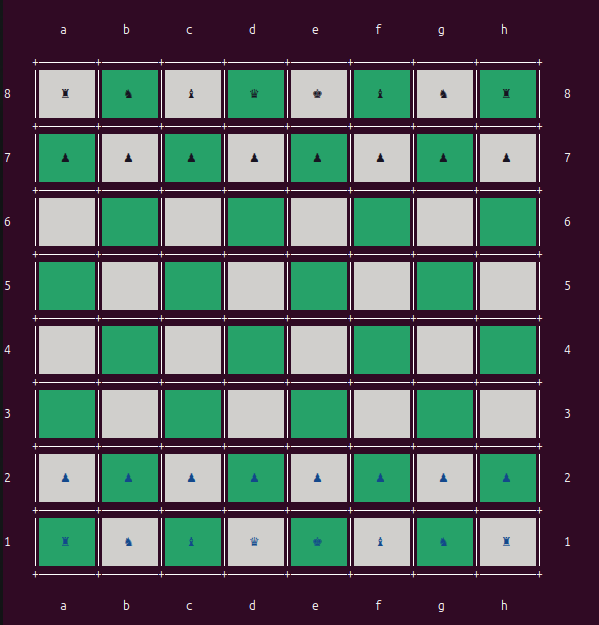

# Chess

A command-line Chess game built with Ruby. This project focuses on object-oriented programming, game logic, and command-line interaction.

## Features

- Two-player chess game in the terminal
- Move validation and turn-based gameplay
- Check and checkmate detection
- Save and load game functionality

## Installation
Clone the repository and navigate to the project directory:

```bash
git clone https://github.com/JohnReyGimenez/Chess.git
cd Chess-CLI
```

## Inspiration

Board rendering logic heavily inspired by Lucas Sorribes' [Ruby Chess blog](https://medium.com/@lucas.sorribes/nostromo-my-ruby-chess-journey-part-i-7ef544b547a5).

## Preview

### Static board

